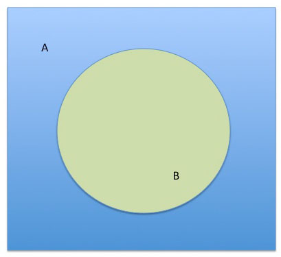
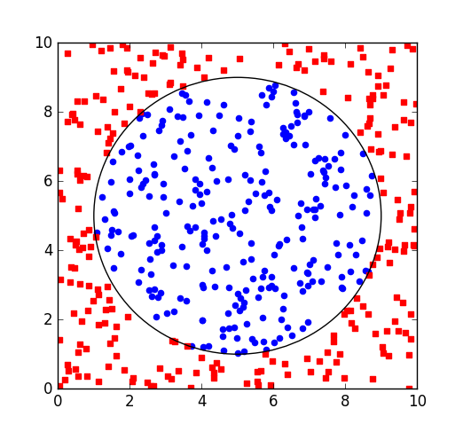

### CI5438 - EM2019

# Proyecto 2

## Redes Neurales

### Resumen
El objetivo de este proyecto es la familiarización del estudiante con el algoritmo de backpropagation sobre redes neuronales del tipo feedforward, así como su uso sobre diversos conjuntos de datos. Para ello se pide que se implemente dicho algoritmo en el lenguaje imperativo de su preferencia; para luego evaluar esa implementación sobre 2 conjuntos de datos: uno generado artificialmente y el clásico *Iris Dataset*.

### Actividades

1. Implemente el algoritmo de backpropagation sobre una red feedforward multicapa.

2. Pruebe su red con el siguiente experimento de clasificación de patrones. Se pretende lograr la clasificación de puntos en un plano pertenecientes a dos regiones predeterminadas (A y B), como se muestran en la siguiente figura:

 

	
	

	El área A es el cuadrado cuya diagonal es el segmento de recta que une los puntos (0, 0) y (10, 10), menos el área que ocupa B . Trabajaremos sobre dos áreas para B:
	El área B esta delimitada por una circunferencia centrada en (5,5) con radio 4. La ecuación canónica de esta circunferencia es: (x - 5)^2 + (y -5)^2 = 36.

	Se entiende por patrón (o ejemplo un punto (x, y) dentro del rectángulo, etiquetado con el área al que este pertenece (A o B ). 
	
	Se les suministrarán tres conjuntos de entrenamiento de 500, 1000 y 2000 patrones ya clasificados. Con estos patrones usted deberá entrenar su red. Los puntos en los datos que se le proporcionan fueron generados uniformemente sobre todo el cuadrado. Estos conjuntos de datos se encuentran en el repositorio de git del proyecto, y tienen como nombre **"datos_P2_EM2019_N[Y].txt"**, donde **Y** es el cantidad de datos en el archivo. Un ejemplo de la visualización de estos datos para **N=500**, con los ejemplos etiquetados "círculo" de color azul y los "no círculo" en rojo, pueden verse en la imágen datos_500.png. 

	

	2.1. Construya una red con 8 neuronas en la capa intemedia. Use el conjunto de datos con **N=2000** para seleccionar la mejor tasa de aprendizaje.

	2.2. Usando la tasa de aprendizaje seleccionada en 2.1. entrene su red para los conjuntos de datos 
	**N=500** y **N=1000**.  

	2.3. Pruebe con redes de 2 a 10 neuronas en la capa intermedia, usando *N=1000* pueden usar la tasa de aprendizaje conseguida en 2.1. 

	2.4. Cree modelos para clasificar dos regiones predeterminadas (como las de la actividad anterior), manteniendo la región A, variando la región B usando los radios r = {3, 2, 1}, pueden usar la tasa de aprendizaje conseguida en 2.1.  Deben generan sus conjuntos de entrenamiento. 

	Para cada modelo (Conjunto de entrenamiento x Número de neuronas x tasa de aprendizaje) reporte los errores de entrenamiento . 

	Tome como conjunto de prueba los puntos (aproximadamente 10.000 = 100 x 100) de un barrido completo de la región cuadrada correctamente etiquetados. 

	Recuerde que por ser las redes neurales algoritmos estocásticos la evaluación de las configuraciones debe hacerse sobre los promedios de al menos 10 corridas. 

	Evalúe los modelos en base a: 1) error en entrenamiento, 2) error en prueba, 3) falsos positivos, 4) falsos negativos. 

	2.4. Para el mejor modelo  encontrado: 

		- Muestre la gráfica de convergencia. 
		- Muestre visualmente la validación del aprendizaje, tomando puntos de un barrido completo de la región cuadrada y coloreando cada punto con un color dependiendo de la clasificación que arroje la red. 

	
	2.5. OPCIONAL: Pruebe con una red de dos capas.

3. Entrene su red para construir dos clasificadores sobre los datos del conjunto Iris Data Set
(http://archive.ics.uci.edu/ml/datasets/Iris ):

	3.1. Uno que separe las "Iris Setosa" del resto (Clasificador binario).

	3.2. Uno que separe cada una de las 3 clases.

	Pruebe con redes de 4 a 10 neuronas en la capa intermedia, usando como conjunto de entrenamiento los siguientes porcentajes de los datos: 50 %, 60 %, 70 %, 80 %, 90 %. Muestre sus resultados. 

	3.3. OPCIONAL: Pruebe con una red de dos capas.

### Entrega

La fecha de entrega sugerida es el día Miércoles 20 de Marzo, a media noche.

Deberán dejar en el repositorio de github de su grupo su código y un breve informe.

El informe debe ser breve y conciso, debe incluir:
	- Resumen. 
	- Detalles de implementación/experimentación. (Lenguaje usado, detalles del algoritmo, etc). 
	- Presentación y discusión de los resultados (En base a los elementos requeridos para cada conjunto de datos) 
	- Conclusiones 
	- Referencias